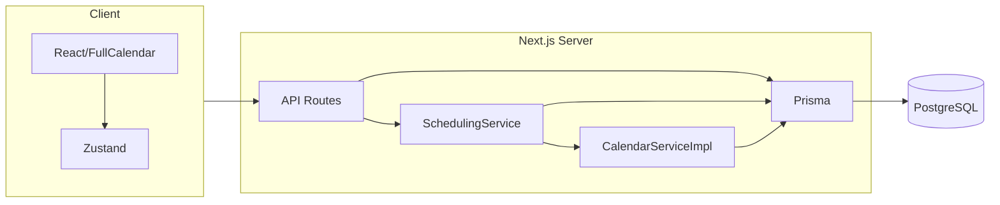

# FluidCalendar Technical Audit

**Date:** 2025-03-07  
**Repo:** [dotnetfactory/fluid-calendar](https://github.com/dotnetfactory/fluid-calendar)  
**Branch:** main

---

## 1. High-Level Architecture

FluidCalendar is a full-stack Next.js 15 application that provides intelligent task scheduling with multi-calendar sync. The architecture is monolithic: a single Next.js app with App Router, API routes for all backend logic, Prisma for persistence, and NextAuth for authentication.

- **Frontend:** React 19, FullCalendar (day/week/month views), Radix UI, Tailwind, Zustand (settings/task state), React Query (server state).
- **Backend:** Next.js 15 App Router API routes, server-side only. No separate API server.
- **Database:** PostgreSQL 16 via Prisma ORM.
- **Auth:** NextAuth.js v4 with JWT strategy. Providers: Credentials (email/password), Google, Azure AD. Session maxAge 1 year.
- **Calendar providers:** Google Calendar, Outlook/Microsoft 365, CalDAV (Nextcloud, Radicale, etc.). Stored in `CalendarFeed` / `ConnectedAccount`; sync and conflict checks via service layer.

---

## 2. Key Folders and Roles

| Path | Role |
|------|------|
| `src/app/` | Next.js App Router: pages, layouts, `(common)` (auth, calendar, tasks, settings, focus, setup), `(open)` (public), `api/` (all API routes). |
| `src/app/api/` | REST-style API routes: auth, tasks, projects, tags, calendar (google/outlook/caldav), feeds, events, auto-schedule-settings, system-settings, task-sync, etc. |
| `src/services/scheduling/` | **Scheduler core:** `SchedulingService`, `TaskSchedulingService`, `TimeSlotManager`, `SlotScorer`, `CalendarServiceImpl`, `CalendarService` interface. |
| `src/lib/` | Shared utilities: `autoSchedule.ts` (work days, energy levels), `date-utils.ts`, `prisma.ts`, auth, google/outlook/caldav clients, task-sync, logger, email. |
| `src/store/` | Zustand stores: settings, tasks, calendar, project, focusMode, etc. Client-side only. |
| `src/components/` | React UI: calendar views, task modals, settings, auth. |
| `src/hooks/` | React hooks (e.g. useCommands). |
| `prisma/` | Schema and migrations. |
| `docker/` | Production Dockerfile. |
| `scripts/` | Repo sync scripts (SAAS ↔ OSS). |

---

## 3. How Tasks Are Created

- **UI:** Task creation flows through components that call API routes (e.g. `POST /api/tasks`).
- **API:** `src/app/api/tasks/route.ts` accepts task payload; creates record via Prisma with `userId` from session.
- **Model:** Task has title, description, status, dueDate, startDate, duration, priority, energyLevel, preferredTime, projectId, tags, isAutoScheduled, scheduleLocked, recurrenceRule, externalTaskId/source for sync.
- **External:** Tasks can be imported from Google Tasks / Outlook To Do via task-sync (TaskProvider, TaskListMapping, TaskChange). Sync is optional and list-based.

---

## 4. How Scheduling Logic Works

### 4.1 Entry Point

- **API:** `POST /api/tasks/schedule-all` (authenticated).
- **Service:** `scheduleAllTasksForUser(userId)` in `TaskSchedulingService.ts`:
  - Loads `AutoScheduleSettings` for user from DB.
  - Loads tasks where `isAutoScheduled === true`, `scheduleLocked === false`, status not completed/in_progress.
  - Clears `scheduledStart`/`scheduledEnd`/`scheduleScore` for those tasks.
  - Instantiates `SchedulingService` with settings, calls `scheduleMultipleTasks(tasks, userId)`.
  - Updates `lastScheduled` on affected tasks.

### 4.2 Scheduling Algorithm (Rule-Based / Heuristic)

- **SchedulingService.scheduleMultipleTasks:**
  - Filters out `scheduleLocked` tasks from rescheduling; they keep existing slots.
  - Uses `TimeSlotManager` to get available slots per task (windows: 7 days only).
  - Computes an initial “best score” per task (first window that has slots).
  - Sorts tasks by that score (highest first), then schedules in order so higher-priority tasks get first pick of slots.
  - For each task: finds slots in 7-day window, picks best slot (first after sort), updates task in DB with `scheduledStart`, `scheduledEnd`, `isAutoScheduled`, `scheduleScore`, then adds that task as an in-memory conflict for subsequent tasks.

- **TimeSlotManagerImpl:**
  - **Slot generation:** `generatePotentialSlots(duration, startDate, endDate)` uses **user timezone** for work-day boundaries (see risk below). Slots at 30-minute intervals; first day starts at “now + 15 min” rounded up or work start; later days start at work start.
  - **Filtering:** Keeps only slots within work hours and work days (from `AutoScheduleSettings`: workDays, workHourStart, workHourEnd).
  - **Conflicts:** Removes slots that overlap calendar events (via `CalendarServiceImpl.findConflicts` / `findBatchConflicts`) or already-scheduled tasks (DB + in-memory list updated as tasks are placed).
  - **Buffer:** Marks slots with adequate before/after buffer within work hours (`bufferMinutes` from settings).
  - **Scoring:** `SlotScorer.scoreSlot(slot, task)` returns a weighted combination of:
    - workHourAlignment, energyLevelMatch, projectProximity, bufferAdequacy, timePreference, deadlineProximity, priorityScore (weights in code; deadline and priority weighted highly).
  - Slots sorted by score descending; first slot is chosen.

- **Provider dependency:** Scheduling uses **user’s selected calendars** (from `AutoScheduleSettings.selectedCalendars`) to fetch events and avoid conflicts. If no calendars selected, no calendar conflicts are applied. Logic is not provider-specific beyond “events from these feed IDs.”

### 4.3 Coupling to UI/Backend

- **Tight coupling:** `TimeSlotManagerImpl` constructor reads **timezone from `useSettingsStore.getState().user.timeZone`** (Zustand). This store is **client-side only**. When `schedule-all` runs on the server, the store is not the requesting user’s; it can be empty or the server’s timezone. **This is the root cause of issue #161 (auto-schedule ignores user timezone).**
- **SchedulingService** can receive `AutoScheduleSettings` from the DB (no UI). It also has a fallback that uses `useSettingsStore.getState().autoSchedule` when no settings are passed, which is similarly wrong on the server.
- **CalendarServiceImpl** and **SlotScorer** only depend on Prisma/settings/task data; they are server-capable if timezone and settings are passed correctly.

**Conclusion:** The scheduling **logic** (slot generation, conflict detection, scoring) is rule-based and heuristic, and is **realistically extractable** once timezone (and any remaining store usage) is supplied from the server (e.g. UserSettings.timeZone from DB by userId).

---

## 5. How Calendar Sync Works

- **Feeds:** Calendars are stored as `CalendarFeed` (type LOCAL, GOOGLE, OUTLOOK, CALDAV) linked to `User` and optionally `ConnectedAccount`. Google/Outlook use OAuth tokens stored in `Account` (NextAuth) or `ConnectedAccount`.
- **Sync:** Sync is triggered by UI or API (e.g. feeds sync routes). Google: Calendar API + optional webhooks. Outlook: Microsoft Graph. CalDAV: tsdav + CalDAV endpoints. Events stored in `CalendarEvent` with `feedId`, start/end, recurrence fields, external IDs.
- **Scheduling:** Conflict checks use `CalendarServiceImpl.getEvents(start, end, calendarIds)` (with caching by week and calendar set), then overlap detection with `areIntervalsOverlapping`. Events and scheduled tasks are both considered.

---

## 6. Authentication Flow

- **Config:** `src/lib/auth/auth-options.ts` — `getAuthOptions()` returns NextAuth options with Credentials, Google, Azure AD providers; JWT callbacks add role and tokens; session callback exposes them.
- **Credentials:** Email/password validated in `authenticateUser()` (credentials-provider); user comes from Prisma (User + password hash comparison).
- **Routes:** `src/app/api/auth/[...nextauth]/route.ts` mounts NextAuth. Sign-in/error pages configured in auth options.
- **API auth:** `authenticateRequest()` in `lib/auth/api-auth.ts` used by API routes to require a valid session and return userId (or 401).

---

## 7. Data Model Overview

- **User,** Account, Session, VerificationToken — NextAuth + app users.
- **UserSettings** — theme, defaultView, **timeZone**, weekStartDay, timeFormat.
- **AutoScheduleSettings** — workDays, workHourStart/End, selectedCalendars, bufferMinutes, energy windows, groupByProject.
- **Task** — core fields (title, status, dueDate, startDate, duration, priority, energyLevel, preferredTime, projectId, tags, isAutoScheduled, scheduleLocked, scheduledStart/End, scheduleScore, recurrenceRule, external ids, sync fields).
- **Project,** Tag — task organization.
- **CalendarFeed,** CalendarEvent — calendars and events.
- **ConnectedAccount** — OAuth for calendar providers (Google, Outlook, CalDAV).
- **TaskProvider,** TaskListMapping, TaskChange — external task sync (Google Tasks, Outlook To Do).
- **SystemSettings** — Google/Outlook client credentials, log level, publicSignup, etc.
- **Log,** JobRecord,** Subscription,** Waitlist,** etc. — logging, jobs, SaaS; not required for core scheduling.

---

## 8. Major Risks or Instability Areas

1. **Timezone bug (#161):** `TimeSlotManagerImpl` uses `useSettingsStore.getState().user.timeZone` on the server, where the store is not user-specific. Schedules are effectively computed in server/default timezone. **Fix:** Pass userId into the scheduler and load `UserSettings.timeZone` from DB (or pass timeZone explicitly from the API layer).
2. **SchedulingService store fallback:** When no `AutoScheduleSettings` is passed, it uses `useSettingsStore.getState().autoSchedule`, which is invalid on the server. Should always load from DB by userId.
3. **Tasks scheduled between events (#150):** Overlap logic exists in `CalendarServiceImpl` and `TimeSlotManager`; possible gaps in batch conflict handling or slot boundaries (e.g. slot end vs event start) could allow overlaps. Needs verification with tests.
4. **Buffer time TODO (TimeSlotManager):** Comment states buffer implementation does not prevent scheduling in buffer periods or check conflicts during buffers; only marks `hasBufferTime`. May allow back-to-back scheduling without real buffer.
5. **CalendarServiceImpl cache:** Event cache keyed by week and calendar IDs; cache invalidation on sync/CRUD is not guaranteed (comment in code). Stale cache could cause wrong conflict detection.
6. **Docker quick start (#151):** Reported broken; needs verification and fix.
7. **Client-only dependencies in server path:** Any other use of `useSettingsStore` or client-only code in API/scheduling path will cause subtle bugs on the server.

---

## 9. Open Questions

- Exact behavior when `selectedCalendars` is empty: no calendar conflicts; is that documented/intended?
- Whether recurring tasks are scheduled as single instances or expanded in the scheduler (current code appears to schedule task records as-is).
- Whether `startDate` on a task is strictly enforced (e.g. no slot before startDate) in all code paths.
- Public API surface for third-party integrations: no formal OpenAPI; routes are de facto REST. Issue #160 requests public API docs.

---

## 10. Scheduling Logic Extractability for Project Ops

| Aspect | Assessment |
|--------|------------|
| **Rule-based vs ML** | Rule-based and heuristic (weighted scoring). No ML. |
| **Provider-dependent** | Only in that “events” come from selected calendar feeds; the algorithm is provider-agnostic. |
| **Tight coupling** | Yes: timezone (and optionally auto-schedule settings) from client store when run from API. Fixable by passing user timezone and settings from DB. |
| **Extractable for reuse** | Yes. Core is in `src/services/scheduling/` and `src/lib/autoSchedule.ts`. With timezone/settings supplied from server/Project Ops, the same slot generation, conflict detection, and scoring can be reused as a library or service (e.g. called from Project Ops API). |

**Critical files for extraction:**  
`SchedulingService.ts`, `TimeSlotManager.ts`, `SlotScorer.ts`, `CalendarServiceImpl.ts` (or an interface), `CalendarService.ts`, `TaskSchedulingService.ts`, `autoSchedule.ts`, `date-utils.ts` (timezone-aware helpers).  
**Dependencies to replace or abstract:** Prisma (replace with your data access), `useSettingsStore` (replace with server-supplied user settings and timezone).
